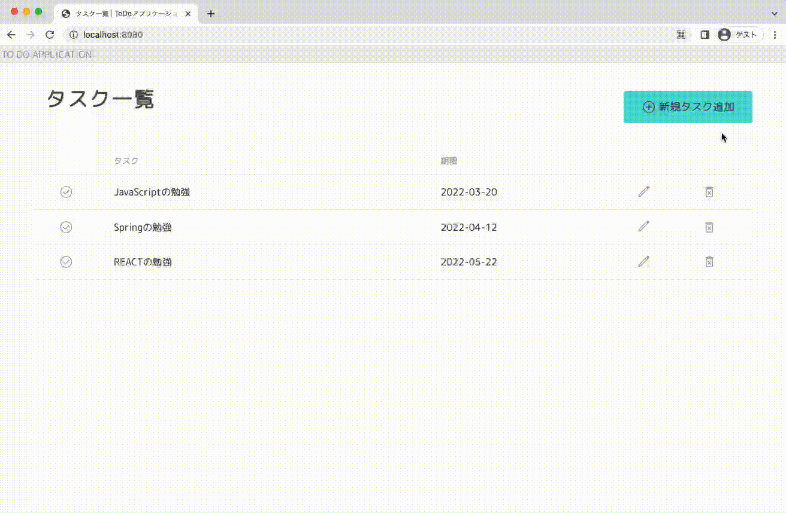

# ToDoListアプリ
RaiseTech 22年03月 第７〜１０回課題用 CRUDアプリ
 

## 概要
ToDoの登録ができるCRUDアプリです。 

## 機能一覧
* 新規登録
* 編集
* 削除
* 未完了⇄完了の切替
 

## 画面一覧
1. リスト一覧画面
2. 新規追加画面
3. 編集画面
 

## URL設計
| 画面名／機能名 | URL | method | Controller method | 
| ------------ | ------------- | ------------- | ------------- | 
| リスト一覧画面表示 | / | GET | ToDoController@showList | 
| 新規追加画面表示 | /form/add | GET | ToDoController@showAddForm | 
| 新規追加 | /form/add | POST | ToDoController@create | 
| 削除 | /delete | POST | ToDoController@delete | 
| 編集画面表示 | /form/editForm/{toDoId} | GET | ToDoController@showEditForm | 
| 編集 | /form/editForm/{toDoId} | POST | ToDoController@edit | 
| Done切替 | /switch | POST | ToDoController@switch | 
 

## 使用技術
* Java 11
* Spring 2.6.7
* MySQL 8.0.28
* Thymeleaf 
* MyBtatis 2.2.0